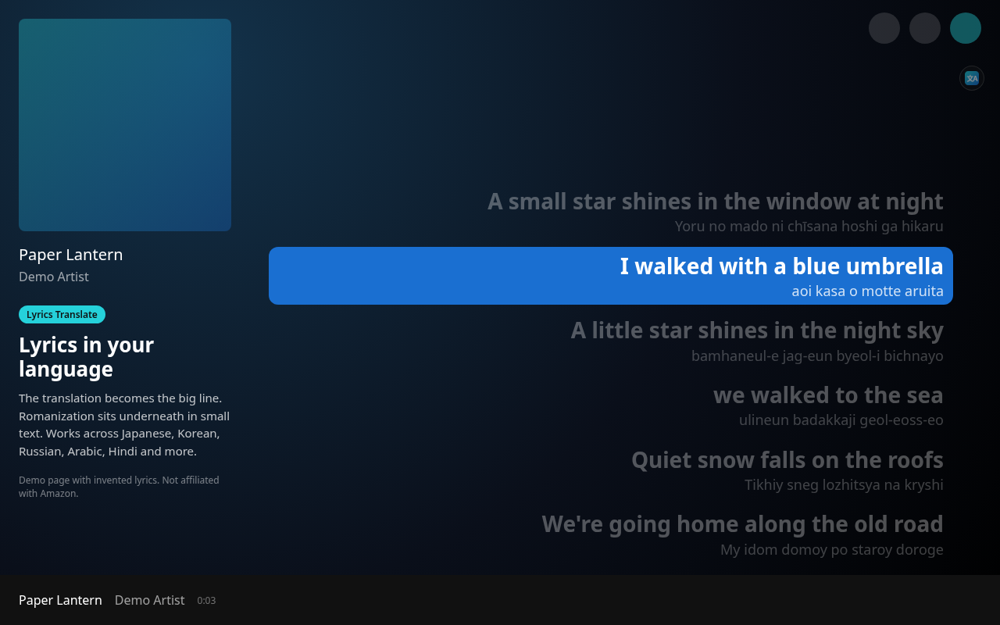
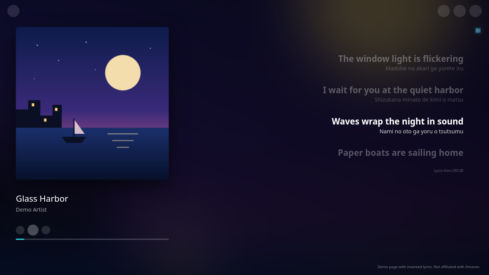

# Lyrics Translate & Romanize for Amazon Music

A free Microsoft Edge extension (Manifest V3, plain JS/HTML/CSS) that translates the lyrics in the Amazon Music web player ([music.amazon.com](https://music.amazon.com)) and adds romanization for non-Latin scripts. When Amazon has no lyrics for a song, it finds synced lyrics on [LRCLIB](https://lrclib.net) and shows them in Amazon's full view.

> **Not affiliated with Amazon.** This is an independent, unofficial extension. It is not made, endorsed or supported by Amazon. Amazon Music is a trademark of Amazon.com, Inc. or its affiliates.

**Get it on [Microsoft Edge Add-ons](https://microsoftedge.microsoft.com/addons/detail/lyrics-translate-romanize-for-amazon-music/jjfhmmdjbkcamelimddcogoopaljflff)**

**Website:** https://noodlesnom.github.io/lyrics-translate-for-amazon-music/ · **Privacy policy:** [PRIVACY.md](PRIVACY.md) ([web version](https://noodlesnom.github.io/lyrics-translate-for-amazon-music/privacy.html)) · **Support:** [GitHub issues](https://github.com/NoodlesNom/lyrics-translate-for-amazon-music/issues)

## Features

- **Two translators:** free Google Translate (no key, no account), or Google Gemini with your own free API key (saved only in your browser) for natural, whole-song translations. If Gemini hits a quota, rejects the key, times out or replies unexpectedly, the song is translated with Google Translate automatically.
- **Romanization** for non-Latin scripts: Japanese (romaji), Chinese (pinyin), Korean, Cyrillic, Arabic, Hebrew, Devanagari, Thai, Greek and more.
- **Translation as the main line**, with the romanization underneath. Turn on **Original lyrics** in the popup to keep the original as the big line instead.
- **Popup:** target language (23 languages), translator dropdown, romanization and translation toggles, text size (85–145%), a "This song" status line, a Gemini status dot, a saved-songs counter and a **Translate this song** button.
- **Floating button** on the page that opens the popup as an in-page panel.
- **Per-song cache:** up to 2000 songs, per translator and language; the least recently played songs are removed first.
- **Skips songs already in your language**, so an English song with English selected never uses your Gemini quota. Since 1.3.4 this also holds when the lyrics contain symbols or a stray look-alike letter (e.g. a Cyrillic "е" typed into an English word), and a mostly English song with a few lines in another script (e.g. a Japanese phrase) only sends those lines to the translator.
- **Update notice for unpacked copies (new in 1.3.4):** copies installed with **Load unpacked** tell you when a new version is out: a small **NEW** badge on the icon and an "Update available: vX.Y.Z · Download" line in the popup, plus a small **Check for updates** link at the bottom of the popup. Store copies never check; Edge updates them automatically.
- **Lyrics when Amazon has none (new in 1.3.4):** if Amazon Music has no lyrics for the current song (no "LYRICS" badge next to the title in the player bar, and an empty lyrics area in the full view), they're looked up on [LRCLIB](https://lrclib.net) (free, open lyrics database) and shown in Amazon's full view, right where Amazon's own lyrics would appear and styled like them, with the current line highlighted in sync with playback, translated and romanized like Amazon's own lyrics. The popup shows "Lyrics added from LRCLIB (synced/unsynced)" (with "· open the full view to see them" while it's closed) or "Amazon has no lyrics; none found on LRCLIB". Only close matches (same title and artist, duration within 3 s) are used. If LRCLIB's lyrics are only a romanization (Japanese romaji, Korean romanization or pinyin), a copy in the original script is used when LRCLIB has one; otherwise the romanization is shown as the romanization line under the translation (new in 1.3.6). Toggle: **Find lyrics when Amazon has none** (on by default).

## Install

- **Microsoft Edge Add-ons (recommended):** [install from the store](https://microsoftedge.microsoft.com/addons/detail/lyrics-translate-romanize-for-amazon-music/jjfhmmdjbkcamelimddcogoopaljflff). Store copies update automatically.
- **Load unpacked:** download the ZIP from the [latest release](https://github.com/NoodlesNom/lyrics-translate-for-amazon-music/releases/latest) (or clone this repo), open `edge://extensions`, turn on **Developer mode**, click **Load unpacked** and select the folder that contains `manifest.json` (the [`extension`](extension) folder in this repo). The same works in Chrome and other Chromium browsers at `chrome://extensions`. Unpacked copies tell you when a new version is out (and have a **Check for updates** link at the bottom of the popup); to update, download the new ZIP, unzip it over your folder and press **Reload** on the extension card.

Full usage notes, the Gemini setup and known limits are in [extension/README.md](extension/README.md).

## Privacy

The developer collects no data and there are no analytics. The lyric lines on screen are sent to Google Translate, and to Google Gemini if you added your own key, only to translate or romanize them. For songs Amazon has no lyrics for, the song's **title, artist and duration are sent to LRCLIB (lrclib.net)** to find lyrics; nothing else, no personal data, no cookies (turn this off with **Find lyrics when Amazon has none**). **Unpacked copies only** ask GitHub's public API (api.github.com) for the latest version number about once a day and when you press **Check for updates**; nothing personal is sent. Store copies never contact GitHub. The key is stored only in `chrome.storage.local`, settings in `chrome.storage.sync` and the translation and LRCLIB caches in `chrome.storage.local`; removing the extension clears them. See [PRIVACY.md](PRIVACY.md).

## Changelog

Newest first. Only 1.2.4, 1.3.4 and 1.3.5 were published before 1.3.6 (the Edge store went from 1.2.4 to 1.3.5); 1.3.0 to 1.3.3 were test builds, first released together in 1.3.4.

- **1.3.6:** Romanized LRCLIB lyrics now show as the romanization line; a Japanese-script copy is preferred when LRCLIB has one. Romanized Korean and Chinese (pinyin) are recognized too, and a Hangul/Chinese-script copy is preferred the same way. With Gemini, the "Original lyrics" line shows its guess of the original script, marked with ≈; without it, Japanese gets a hiragana guess and Korean/Chinese show no original line. The popup says "LRCLIB lyrics were already romanized". Tidier popup checkboxes: "Find lyrics when Amazon has none" now has its checkbox on the left, like the Show toggles. The floating button shows the Gemini status dot (same colors as the popup, with a tooltip) while Gemini is the selected translator. No new permissions.
- **1.3.5:** Fixed: after jumping ahead in a song, the highlighted line could scroll off screen (worse with big text). The current line is now brought back to the middle of Amazon's lyrics right away; the extension leaves the lyrics alone for 3 seconds after you scroll them yourself. Popup fits without scroll bars again. No new permissions.
- **1.3.4:** first public release with LRCLIB lyrics for songs Amazon has none for and the smarter language check (1.3.0–1.3.3 below). Also: copies installed with **Load unpacked** now tell you when a new version is out (a **NEW** badge and an "Update available" line in the popup with a download link) and get a **Check for updates** button. They read the latest version number from GitHub about once a day. Store copies are unchanged: they never check and update automatically. No new permissions.
- **1.3.3** *(test build, released in 1.3.4)*: smarter language check. Songs already in your language never go to Gemini, even with symbols, emoji or a look-alike letter from another alphabet; a mostly English song with a few foreign lines only gets those lines translated. The popup says e.g. "Mostly English · translated 2 lines with Gemini".
- **1.3.2** *(test build, released in 1.3.4)*: LRCLIB lyrics are shown in Amazon's full view, in the spot and style of Amazon's own lyrics (white current line, dim other lines), with a small "Lyrics from LRCLIB" credit.
- **1.3.1** *(test build, released in 1.3.4)*: reliable detection of songs without Amazon lyrics (the player bar's "Lyrics available" badge) and the song's title/artist in the popup's "This song" line.
- **1.3.0** *(test build, released in 1.3.4)*: synced lyrics from [LRCLIB](https://lrclib.net) for songs Amazon has no lyrics for, following playback, seeks and pauses, translated and romanized. New toggle **Find lyrics when Amazon has none** (on by default); only new permission `https://lrclib.net/*`.
- **1.2.4:** first release: translation and romanization with Google Translate or your own Gemini key, per-song cache, floating button.

Downloads: [GitHub releases](https://github.com/NoodlesNom/lyrics-translate-for-amazon-music/releases).

## Permissions

| Permission | Why |
| --- | --- |
| `storage` | Settings (sync storage); Gemini key, Gemini status, the translation cache and the LRCLIB lyrics cache (local storage). |
| Content script on `https://music.amazon.com/*` | Reads the lyric lines on screen, the player bar and the full view (song title, artist and track link, playback time, the "Lyrics available" badge), and adds the translation/romanization lines, the floating button and, in the full view, the LRCLIB lyrics. Runs on no other site. |
| `https://clients5.google.com/*`, `https://translate.googleapis.com/*` | Google Translate web endpoints (the second is a fallback) for translation and romanization. |
| `https://generativelanguage.googleapis.com/*` | Gemini API, only when you saved your own key and Gemini is selected. |
| `https://lrclib.net/*` | LRCLIB lyrics API, only for songs Amazon has no lyrics for (title, artist and duration are sent), while "Find lyrics when Amazon has none" is on. |
| (no permission) `chrome.management.getSelf()` and `https://api.github.com` | Unpacked copies only: `getSelf()` tells unpacked from store installs (it needs no `management` permission), and the latest release's version number is read from GitHub's public API, which allows cross-origin requests, so no host permission is needed. Store copies never make this request. |
| `web_accessible_resources`: `popup.html`, `popup.js`, `icons/icon48.png` (only for `music.amazon.com`) | Lets the floating button show its icon and open the popup as an in-page panel. |

## Repository layout

- `extension/`: the extension itself (load this folder unpacked, or zip its contents for the store).
- `docs/`: the GitHub Pages website and privacy policy.
- `tests/`: Playwright tests that load the unpacked extension against a local mock of the lyrics view. All lyric lines in the mock, the fixtures and the mocked LRCLIB answers are invented test text.

## License

[MIT](LICENSE) © NoodlesNom
